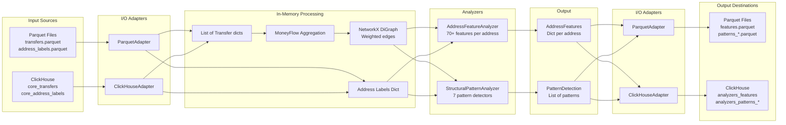
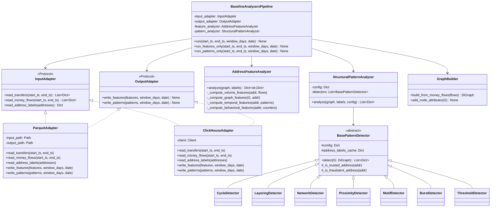

# Analyzers-Baseline Architecture

## 1. Overview

The `analyzers-baseline` package is an **independent, pip-installable Python library** that extracts the core analytical algorithms from `analytics-pipeline/packages/analyzers/`. It serves as:

1. **The official baseline** for the Analytics Tournament in the benchmark system
2. **A reusable library** that `data-pipeline` can import for production use
3. **A reference implementation** that tournament participants can fork and improve

### Key Design Decisions

- **Decoupled from ClickHouse** - Core algorithms receive data in-memory (loaded from Parquet or ClickHouse)
- **Two I/O Adapters** - Parquet (for tournament) and ClickHouse (for production)
- **Separate Entry Points** - Features and Patterns can be tested independently
- **Combined Production Pipeline** - `BaselineAnalyzersPipeline` runs both for production
- **Full Schema Preservation** - All 70+ features and all pattern types with specialized fields

## 2. Package Structure

```
analyzers-baseline/
├── pyproject.toml                    # Package config (pip-installable)
├── README.md
├── LICENSE
├── .gitignore
│
├── src/
│   └── analyzers_baseline/
│       ├── __init__.py               # Public exports
│       │
│       ├── protocols/                # Abstract interfaces (Python Protocols)
│       │   ├── __init__.py
│       │   ├── analyzer.py           # FeatureAnalyzer, PatternAnalyzer protocols
│       │   ├── io.py                 # InputAdapter, OutputAdapter protocols
│       │   └── models.py             # Transfer, MoneyFlow, AddressFeatures, PatternDetection
│       │
│       ├── features/                 # Feature computation implementations
│       │   ├── __init__.py
│       │   ├── analyzer.py           # Main AddressFeatureAnalyzer implementation
│       │   ├── volume.py             # Volume-related features
│       │   ├── graph.py              # Graph-based features (PageRank, betweenness, etc.)
│       │   ├── temporal.py           # Time-based features (entropy, regularity, etc.)
│       │   ├── behavioral.py         # Behavioral features (structuring, etc.)
│       │   └── constants.py          # Feature names and defaults
│       │
│       ├── patterns/                 # Pattern detection implementations
│       │   ├── __init__.py
│       │   ├── analyzer.py           # Main StructuralPatternAnalyzer implementation
│       │   ├── base.py               # BasePatternDetector abstract class
│       │   ├── cycle.py              # CycleDetector
│       │   ├── layering.py           # LayeringDetector
│       │   ├── motif.py              # MotifDetector (fan-in/fan-out)
│       │   ├── network.py            # NetworkDetector (SCC, smurfing)
│       │   ├── proximity.py          # ProximityDetector (risk proximity)
│       │   ├── burst.py              # BurstDetector (temporal bursts)
│       │   └── threshold.py          # ThresholdDetector (threshold evasion)
│       │
│       ├── adapters/                 # I/O adapters
│       │   ├── __init__.py
│       │   ├── parquet.py            # ParquetAdapter - read/write Parquet files
│       │   └── clickhouse.py         # ClickHouseAdapter - read/write ClickHouse
│       │
│       ├── graph/                    # Graph utilities
│       │   ├── __init__.py
│       │   └── builder.py            # Build NetworkX DiGraph from MoneyFlow data
│       │
│       ├── pipeline/                 # Production pipeline
│       │   ├── __init__.py
│       │   └── baseline.py           # BaselineAnalyzersPipeline
│       │
│       ├── config/                   # Configuration
│       │   ├── __init__.py
│       │   ├── settings.py           # Pydantic settings
│       │   └── defaults/
│       │       └── structural_patterns.json
│       │
│       └── cli/                      # CLI entry points
│           ├── __init__.py
│           ├── features.py           # python -m analyzers_baseline.cli.features
│           ├── patterns.py           # python -m analyzers_baseline.cli.patterns
│           └── pipeline.py           # python -m analyzers_baseline.cli.pipeline
│
└── tests/                            # Test boilerplate
    ├── conftest.py                   # Pytest fixtures
    ├── unit/
    │   ├── test_features/
    │   │   └── test_volume.py
    │   └── test_patterns/
    │       └── test_cycle.py
    └── integration/
        └── test_pipeline.py
```

## 3. Data Flow Architecture



## 4. Core Protocols (Interfaces)

### 4.1 Data Models

```python
# src/analyzers_baseline/protocols/models.py

from typing import Protocol, Dict, List, Any, Optional
from decimal import Decimal
from dataclasses import dataclass

@dataclass
class Transfer:
    """Single transfer edge from core_transfers."""
    tx_id: str
    event_index: str
    edge_index: str
    block_height: int
    block_timestamp: int  # milliseconds since epoch
    from_address: str
    to_address: str
    asset_symbol: str
    asset_contract: str
    amount: Decimal
    amount_usd: Decimal
    fee: Decimal

@dataclass
class MoneyFlow:
    """Aggregated flow between two addresses."""
    from_address: str
    to_address: str
    amount_usd_sum: Decimal
    tx_count: int

@dataclass
class AddressLabel:
    """Address label information."""
    address: str
    label: str
    address_type: str
    trust_level: str
    source: str
```

### 4.2 Analyzer Protocols

```python
# src/analyzers_baseline/protocols/analyzer.py

from typing import Protocol, Dict, List
import networkx as nx

class FeatureAnalyzer(Protocol):
    """Protocol for feature computation."""
    
    def analyze(
        self,
        graph: nx.DiGraph,
        address_labels: Dict[str, Dict]
    ) -> Dict[str, Dict]:
        """
        Compute features for all addresses in the graph.
        
        Args:
            graph: NetworkX DiGraph with weighted edges (amount_usd_sum, tx_count)
            address_labels: Mapping of address -> label info
            
        Returns:
            Mapping of address -> feature dict (70+ features)
        """
        ...

class PatternAnalyzer(Protocol):
    """Protocol for pattern detection."""
    
    def analyze(
        self,
        graph: nx.DiGraph,
        address_labels: Dict[str, Dict],
        config: Dict
    ) -> List[Dict]:
        """
        Detect structural patterns in the graph.
        
        Args:
            graph: NetworkX DiGraph with weighted edges
            address_labels: Mapping of address -> label info
            config: Pattern detection configuration
            
        Returns:
            List of pattern dictionaries with type-specific fields
        """
        ...
```

### 4.3 I/O Adapter Protocols

```python
# src/analyzers_baseline/protocols/io.py

from typing import Protocol, Dict, List, Optional

class InputAdapter(Protocol):
    """Protocol for reading input data."""
    
    def read_transfers(
        self,
        start_timestamp_ms: int,
        end_timestamp_ms: int
    ) -> List[Dict]:
        """Read transfers for the given time window."""
        ...
    
    def read_money_flows(
        self,
        start_timestamp_ms: int,
        end_timestamp_ms: int
    ) -> List[Dict]:
        """Read or compute aggregated money flows for the time window."""
        ...
    
    def read_address_labels(
        self,
        addresses: List[str]
    ) -> Dict[str, Dict]:
        """Read address labels for the given addresses."""
        ...

class OutputAdapter(Protocol):
    """Protocol for writing output data."""
    
    def write_features(
        self,
        features: List[Dict],
        window_days: int,
        processing_date: str
    ) -> None:
        """Write computed features."""
        ...
    
    def write_patterns(
        self,
        patterns: List[Dict],
        window_days: int,
        processing_date: str
    ) -> None:
        """Write detected patterns to type-specific destinations."""
        ...
```

## 5. Complete Feature Schema

The feature analyzer computes **70+ features** per address, matching the `analyzers_features` table schema exactly:

### 5.1 Time Series Dimensions
| Field | Type | Description |
|-------|------|-------------|
| window_days | Int | Analysis window size (7, 30, 90, 180) |
| processing_date | Date | Date of processing run |

### 5.2 Core Identifiers
| Field | Type | Description |
|-------|------|-------------|
| address | String | Wallet address |
| degree_in | Int | Incoming edge count |
| degree_out | Int | Outgoing edge count |
| degree_total | Int | Total unique counterparties |
| unique_counterparties | Int | Unique counterparty count |

### 5.3 Volume Features
| Field | Type | Description |
|-------|------|-------------|
| total_in_usd | Decimal128 | Total incoming USD |
| total_out_usd | Decimal128 | Total outgoing USD |
| net_flow_usd | Decimal128 | Net flow (in - out) |
| total_volume_usd | Decimal128 | Total volume (in + out) |
| avg_tx_in_usd | Decimal128 | Average incoming transaction USD |
| avg_tx_out_usd | Decimal128 | Average outgoing transaction USD |
| median_tx_in_usd | Decimal128 | Median incoming transaction USD |
| median_tx_out_usd | Decimal128 | Median outgoing transaction USD |
| max_tx_usd | Decimal128 | Maximum transaction USD |
| min_tx_usd | Decimal128 | Minimum transaction USD |

### 5.4 Statistical Features
| Field | Type | Description |
|-------|------|-------------|
| amount_variance | Float64 | Variance of transaction amounts |
| amount_skewness | Float64 | Skewness of amount distribution |
| amount_kurtosis | Float64 | Kurtosis of amount distribution |
| volume_std | Float64 | Standard deviation of volumes |
| volume_cv | Float64 | Coefficient of variation |
| flow_concentration | Float64 | Gini coefficient of flows |

### 5.5 Transaction Counts
| Field | Type | Description |
|-------|------|-------------|
| tx_in_count | Int | Incoming transaction count |
| tx_out_count | Int | Outgoing transaction count |
| tx_total_count | Int | Total transaction count |

### 5.6 Temporal Features
| Field | Type | Description |
|-------|------|-------------|
| activity_days | Int | Number of active days |
| activity_span_days | Int | Days between first and last activity |
| avg_daily_volume_usd | Decimal128 | Average daily volume |
| peak_hour | Int | Most active hour (0-23) |
| peak_day | Int | Most active day of week (1-7) |
| regularity_score | Float64 | Activity regularity score |
| burst_factor | Float64 | Burst activity factor |

### 5.7 Flow Characteristics
| Field | Type | Description |
|-------|------|-------------|
| reciprocity_ratio | Float64 | Ratio of bidirectional flows |
| flow_diversity | Float64 | Shannon entropy of flow distribution |
| counterparty_concentration | Float64 | Concentration of counterparty volumes |
| velocity_score | Float64 | Transaction velocity score |
| structuring_score | Float64 | Structuring behavior score |

### 5.8 Behavioral Pattern Features
| Field | Type | Description |
|-------|------|-------------|
| hourly_entropy | Float64 | Entropy of hourly activity |
| daily_entropy | Float64 | Entropy of daily activity |
| weekend_transaction_ratio | Float64 | Ratio of weekend transactions |
| night_transaction_ratio | Float64 | Ratio of night transactions |
| consistency_score | Float64 | Behavioral consistency score |

### 5.9 Classification Features
| Field | Type | Description |
|-------|------|-------------|
| is_new_address | Bool | First seen in this window |
| is_dormant_reactivated | Bool | Reactivated after dormancy |

### 5.10 Supporting Metrics
| Field | Type | Description |
|-------|------|-------------|
| unique_recipients_count | Int | Count of unique recipients |
| unique_senders_count | Int | Count of unique senders |

### 5.11 Graph Analytics Features
| Field | Type | Description |
|-------|------|-------------|
| pagerank | Float64 | PageRank centrality |
| betweenness | Float64 | Betweenness centrality |
| closeness | Float64 | Closeness centrality |
| clustering_coefficient | Float64 | Local clustering coefficient |
| kcore | Int | K-core decomposition value |
| community_id | Int | Community detection ID |
| centrality_score | Float64 | Composite centrality score |

### 5.12 K-Hop Neighborhood Features
| Field | Type | Description |
|-------|------|-------------|
| khop1_count | Int | 1-hop neighbor count |
| khop2_count | Int | 2-hop neighbor count |
| khop3_count | Int | 3-hop neighbor count |
| khop1_volume_usd | Decimal128 | 1-hop neighbor total volume |
| khop2_volume_usd | Decimal128 | 2-hop neighbor total volume |
| khop3_volume_usd | Decimal128 | 3-hop neighbor total volume |

### 5.13 Advanced Flow Features
| Field | Type | Description |
|-------|------|-------------|
| flow_reciprocity_entropy | Float64 | Entropy of reciprocal flows |
| counterparty_stability | Float64 | Stability of counterparty relationships |
| flow_burstiness | Float64 | Burstiness measure |
| transaction_regularity | Float64 | Transaction timing regularity |
| amount_predictability | Float64 | Amount predictability score |

### 5.14 Temporal Metadata
| Field | Type | Description |
|-------|------|-------------|
| first_activity_timestamp | Int64 | First activity timestamp (ms) |
| last_activity_timestamp | Int64 | Last activity timestamp (ms) |

### 5.15 Asset Diversity
| Field | Type | Description |
|-------|------|-------------|
| unique_assets_in | Int | Unique incoming assets |
| unique_assets_out | Int | Unique outgoing assets |
| dominant_asset_in | String | Most used incoming asset |
| dominant_asset_out | String | Most used outgoing asset |
| asset_diversity_score | Float64 | Asset diversity score |

### 5.16 Behavioral Pattern Arrays
| Field | Type | Description |
|-------|------|-------------|
| hourly_activity | Array(Int) | 24-hour activity histogram |
| daily_activity | Array(Int) | 7-day activity histogram |
| peak_activity_hour | Int | Peak activity hour |
| peak_activity_day | Int | Peak activity day |

### 5.17 Additional Metrics
| Field | Type | Description |
|-------|------|-------------|
| small_transaction_ratio | Float64 | Ratio of small transactions |
| concentration_ratio | Float64 | Top counterparty concentration |

## 6. Complete Pattern Schema

Patterns are stored in **type-specific tables** with common and specialized fields.

### 6.1 Common Fields (All Pattern Types)
| Field | Type | Description |
|-------|------|-------------|
| window_days | Int | Analysis window size |
| processing_date | Date | Processing run date |
| pattern_id | String | Unique pattern identifier |
| pattern_type | String | Pattern type enum |
| pattern_hash | String | Hash for deduplication |
| addresses_involved | Array(String) | Participating addresses |
| address_roles | Array(String) | Role of each address |
| detection_timestamp | Int64 | Detection timestamp (unix) |
| pattern_start_time | Int64 | Pattern start timestamp |
| pattern_end_time | Int64 | Pattern end timestamp |
| pattern_duration_hours | Int | Pattern duration |
| evidence_transaction_count | Int | Transaction count |
| evidence_volume_usd | Decimal128 | Total USD volume |
| detection_method | String | Detection algorithm used |

### 6.2 CYCLE Pattern Fields (`analyzers_patterns_cycle`)
| Field | Type | Description |
|-------|------|-------------|
| cycle_path | Array(String) | Ordered addresses in cycle |
| cycle_length | Int | Number of nodes in cycle |
| cycle_volume_usd | Decimal128 | Total cycle volume |

### 6.3 LAYERING_PATH Pattern Fields (`analyzers_patterns_layering`)
| Field | Type | Description |
|-------|------|-------------|
| layering_path | Array(String) | Ordered path addresses |
| path_depth | Int | Path length |
| path_volume_usd | Decimal128 | Total path volume |
| source_address | String | Path source |
| destination_address | String | Path destination |

### 6.4 SMURFING_NETWORK Pattern Fields (`analyzers_patterns_network`)
| Field | Type | Description |
|-------|------|-------------|
| network_members | Array(String) | Network member addresses |
| network_size | Int | Number of members |
| network_density | Float64 | Network density score |
| hub_addresses | Array(String) | Hub addresses identified |

### 6.5 PROXIMITY_RISK Pattern Fields (`analyzers_patterns_proximity`)
| Field | Type | Description |
|-------|------|-------------|
| risk_source_address | String | Known risky address |
| distance_to_risk | Int | Hop distance to risk |

### 6.6 MOTIF Pattern Fields (`analyzers_patterns_motif`)
| Field | Type | Description |
|-------|------|-------------|
| motif_type | String | FANIN or FANOUT |
| motif_center_address | String | Center address of motif |
| motif_participant_count | Int | Number of participants |

### 6.7 TEMPORAL_BURST Pattern Fields (`analyzers_patterns_burst`)
| Field | Type | Description |
|-------|------|-------------|
| burst_address | String | Address with burst activity |
| burst_start_timestamp | Int64 | Burst start time |
| burst_end_timestamp | Int64 | Burst end time |
| burst_duration_seconds | Int | Burst duration |
| burst_transaction_count | Int | Transactions in burst |
| burst_volume_usd | Decimal128 | Volume in burst |
| normal_tx_rate | Float64 | Normal transaction rate |
| burst_tx_rate | Float64 | Burst transaction rate |
| burst_intensity | Float64 | Burst intensity score |
| z_score | Float64 | Statistical z-score |
| hourly_distribution | Array(Float64) | Hourly distribution |
| peak_hours | Array(Int) | Peak hours identified |

### 6.8 THRESHOLD_EVASION Pattern Fields (`analyzers_patterns_threshold`)
| Field | Type | Description |
|-------|------|-------------|
| primary_address | String | Address evading threshold |
| threshold_value | Decimal128 | Threshold being evaded |
| threshold_type | String | Type of threshold |
| transactions_near_threshold | Int | Transactions near threshold |
| avg_transaction_size | Decimal128 | Average transaction size |
| max_transaction_size | Decimal128 | Maximum transaction size |
| size_consistency | Float64 | Size consistency score |
| clustering_score | Float64 | Transaction clustering score |
| unique_days | Int | Unique activity days |
| avg_daily_transactions | Float64 | Average daily transactions |
| temporal_spread_score | Float64 | Temporal spread score |
| threshold_avoidance_score | Float64 | Overall avoidance score |

## 7. Integration With External Systems

### 7.1 With data-pipeline (Production)

```python
# data-pipeline/requirements.txt
analyzers-baseline>=1.0.0

# data-pipeline/packages/jobs/tasks/daily_pipeline_task.py
from analyzers_baseline import BaselineAnalyzersPipeline
from analyzers_baseline.adapters import ClickHouseAdapter

def run_analytics(client, network, window_days, processing_date, start_ts, end_ts):
    adapter = ClickHouseAdapter(client)
    
    pipeline = BaselineAnalyzersPipeline(
        input_adapter=adapter,
        output_adapter=adapter,
        config_path=f"config/{network}_patterns.json"
    )
    
    pipeline.run(
        start_timestamp_ms=start_ts,
        end_timestamp_ms=end_ts,
        window_days=window_days,
        processing_date=processing_date
    )
```

### 7.2 With benchmark (Tournament Testing)

```bash
# Tournament container receives Parquet files and writes Parquet outputs

# Run full pipeline
python -m analyzers_baseline.cli.pipeline \
    --input-type parquet \
    --input-path /data/input/ \
    --output-type parquet \
    --output-path /data/output/ \
    --window-days 30 \
    --processing-date 2025-01-15

# Expected input files:
# /data/input/transfers.parquet
# /data/input/address_labels.parquet

# Expected output files:
# /data/output/features.parquet
# /data/output/patterns_cycle.parquet
# /data/output/patterns_layering.parquet
# /data/output/patterns_network.parquet
# /data/output/patterns_proximity.parquet
# /data/output/patterns_motif.parquet
# /data/output/patterns_burst.parquet
# /data/output/patterns_threshold.parquet
```

### 7.3 Testing Features Independently

```bash
# Run only features
python -m analyzers_baseline.cli.features \
    --input-type parquet \
    --input-path /data/input/ \
    --output-type parquet \
    --output-path /data/output/ \
    --window-days 30 \
    --processing-date 2025-01-15

# Output: /data/output/features.parquet
```

### 7.4 Testing Patterns Independently

```bash
# Run only patterns
python -m analyzers_baseline.cli.patterns \
    --input-type parquet \
    --input-path /data/input/ \
    --output-type parquet \
    --output-path /data/output/ \
    --window-days 30 \
    --processing-date 2025-01-15

# Output: /data/output/patterns_*.parquet
```

## 8. Class Diagram



## 9. Test Boilerplate

### 9.1 Unit Test Example (Features)

```python
# tests/unit/test_features/test_volume.py

import pytest
from analyzers_baseline.features.volume import compute_volume_features

def test_volume_features_simple_flows():
    """Test basic volume feature computation."""
    flows = [
        {"from_address": "A", "to_address": "B", "amount_usd_sum": 100.0, "tx_count": 1},
        {"from_address": "C", "to_address": "A", "amount_usd_sum": 50.0, "tx_count": 2},
    ]
    
    features = compute_volume_features("A", flows)
    
    assert features["total_in_usd"] == pytest.approx(50.0)
    assert features["total_out_usd"] == pytest.approx(100.0)
    assert features["net_flow_usd"] == pytest.approx(-50.0)
    assert features["total_volume_usd"] == pytest.approx(150.0)

def test_volume_features_no_activity():
    """Test volume features for address with no flows."""
    features = compute_volume_features("X", [])
    
    assert features["total_in_usd"] == 0
    assert features["total_out_usd"] == 0
```

### 9.2 Unit Test Example (Patterns)

```python
# tests/unit/test_patterns/test_cycle.py

import pytest
import networkx as nx
from analyzers_baseline.patterns.cycle import CycleDetector

def test_simple_cycle_detection():
    """Test detection of a simple 3-node cycle."""
    G = nx.DiGraph()
    G.add_edge("A", "B", amount_usd_sum=100, tx_count=1)
    G.add_edge("B", "C", amount_usd_sum=100, tx_count=1)
    G.add_edge("C", "A", amount_usd_sum=100, tx_count=1)
    
    config = {"cycle_detection": {"min_cycle_length": 3, "max_cycle_length": 10, "max_cycles_per_scc": 100}}
    detector = CycleDetector(config=config, address_labels_cache={}, network="test")
    
    patterns = detector.detect(G)
    
    assert len(patterns) == 1
    assert set(patterns[0]["addresses_involved"]) == {"A", "B", "C"}
    assert patterns[0]["pattern_type"] == "CYCLE"

def test_no_cycle():
    """Test that linear paths don't produce cycle detections."""
    G = nx.DiGraph()
    G.add_edge("A", "B", amount_usd_sum=100, tx_count=1)
    G.add_edge("B", "C", amount_usd_sum=100, tx_count=1)
    
    config = {"cycle_detection": {"min_cycle_length": 3, "max_cycle_length": 10, "max_cycles_per_scc": 100}}
    detector = CycleDetector(config=config, address_labels_cache={}, network="test")
    
    patterns = detector.detect(G)
    
    assert len(patterns) == 0
```

### 9.3 Integration Test Example

```python
# tests/integration/test_pipeline.py

import pytest
from pathlib import Path
from analyzers_baseline import BaselineAnalyzersPipeline
from analyzers_baseline.adapters import ParquetAdapter

@pytest.fixture
def sample_data_path(tmp_path):
    """Create sample Parquet files for testing."""
    import pandas as pd
    
    # Create sample transfers
    transfers_df = pd.DataFrame([
        {"tx_id": "tx1", "from_address": "A", "to_address": "B", 
         "amount": 100, "amount_usd": 100, "block_timestamp": 1000000000000},
        {"tx_id": "tx2", "from_address": "B", "to_address": "C",
         "amount": 50, "amount_usd": 50, "block_timestamp": 1000000001000},
    ])
    transfers_df.to_parquet(tmp_path / "transfers.parquet")
    
    # Create sample address labels
    labels_df = pd.DataFrame([
        {"address": "A", "label": "exchange", "address_type": "EXCHANGE", "trust_level": "VERIFIED"}
    ])
    labels_df.to_parquet(tmp_path / "address_labels.parquet")
    
    return tmp_path

def test_full_pipeline(sample_data_path, tmp_path):
    """Test full pipeline execution with Parquet I/O."""
    output_path = tmp_path / "output"
    output_path.mkdir()
    
    adapter = ParquetAdapter(
        input_path=sample_data_path,
        output_path=output_path
    )
    
    pipeline = BaselineAnalyzersPipeline(
        input_adapter=adapter,
        output_adapter=adapter
    )
    
    pipeline.run(
        start_timestamp_ms=1000000000000,
        end_timestamp_ms=1000000002000,
        window_days=30,
        processing_date="2025-01-15"
    )
    
    # Verify outputs exist
    assert (output_path / "features.parquet").exists()
```

## 10. Configuration

### 10.1 Pydantic Settings

```python
# src/analyzers_baseline/config/settings.py

from pydantic_settings import BaseSettings
from typing import Optional
from pathlib import Path

class AnalyzerSettings(BaseSettings):
    """Configuration for analyzers-baseline."""
    
    # I/O Settings
    input_type: str = "parquet"  # "parquet" or "clickhouse"
    output_type: str = "parquet"
    input_path: Optional[Path] = None
    output_path: Optional[Path] = None
    
    # ClickHouse Settings (when using clickhouse adapter)
    clickhouse_host: str = "localhost"
    clickhouse_port: int = 8123
    clickhouse_database: str = "default"
    clickhouse_user: str = "default"
    clickhouse_password: str = ""
    
    # Processing Settings
    window_days: int = 30
    processing_date: Optional[str] = None
    
    # Pattern Detection Config
    pattern_config_path: Optional[Path] = None
    
    class Config:
        env_prefix = "ANALYZER_"
        env_file = ".env"
```

### 10.2 Default Pattern Configuration

```json
// src/analyzers_baseline/config/defaults/structural_patterns.json
{
  "cycle_detection": {
    "min_cycle_length": 3,
    "max_cycle_length": 10,
    "max_cycles_per_scc": 100
  },
  "layering_detection": {
    "min_path_length": 3,
    "max_path_length": 10
  },
  "motif_detection": {
    "min_fanout_degree": 5,
    "min_fanin_degree": 5
  },
  "network_detection": {
    "min_scc_size": 5
  },
  "proximity_detection": {
    "max_hop_distance": 3
  },
  "burst_detection": {
    "z_score_threshold": 3.0,
    "min_burst_transactions": 5
  },
  "threshold_detection": {
    "thresholds": [
      {"value": 10000, "type": "CTR", "tolerance_pct": 0.05},
      {"value": 15000, "type": "EU_AML", "tolerance_pct": 0.05}
    ]
  }
}
```

## 11. Package Metadata

```toml
# pyproject.toml

[build-system]
requires = ["setuptools>=61.0", "wheel"]
build-backend = "setuptools.build_meta"

[project]
name = "analyzers-baseline"
version = "1.0.0"
description = "Baseline analytics algorithms for blockchain pattern detection and feature engineering"
readme = "README.md"
license = {text = "Apache-2.0"}
authors = [
    {name = "ChainSwarm Team"}
]
requires-python = ">=3.11"
classifiers = [
    "Programming Language :: Python :: 3",
    "Programming Language :: Python :: 3.11",
    "Programming Language :: Python :: 3.12",
    "License :: OSI Approved :: Apache Software License",
    "Operating System :: OS Independent",
]
dependencies = [
    "networkx>=3.0",
    "numpy>=1.24",
    "pandas>=2.0",
    "pyarrow>=14.0",
    "pydantic>=2.0",
    "pydantic-settings>=2.0",
    "loguru>=0.7",
    "click>=8.0",
]

[project.optional-dependencies]
clickhouse = [
    "clickhouse-connect>=0.7.0",
]
dev = [
    "pytest>=7.0",
    "pytest-asyncio>=0.21",
]

[project.scripts]
analyzers-baseline = "analyzers_baseline.cli.pipeline:main"

[project.entry-points."console_scripts"]
analyzers-features = "analyzers_baseline.cli.features:main"
analyzers-patterns = "analyzers_baseline.cli.patterns:main"

[tool.setuptools.packages.find]
where = ["src"]
```

## 12. Summary

The `analyzers-baseline` package provides:

1. **Complete Algorithm Extraction** - All 70+ features and 7 pattern detectors from `analytics-pipeline`
2. **Dual I/O Support** - Parquet for tournament testing, ClickHouse for production
3. **Separate Testing** - Features and patterns can be tested independently
4. **Combined Production** - `BaselineAnalyzersPipeline` runs both for production use
5. **Full Schema Preservation** - Output matches existing `analyzers_features` and `analyzers_patterns_*` tables exactly
6. **Pip-Installable** - Can be installed in both `data-pipeline` and `benchmark` projects